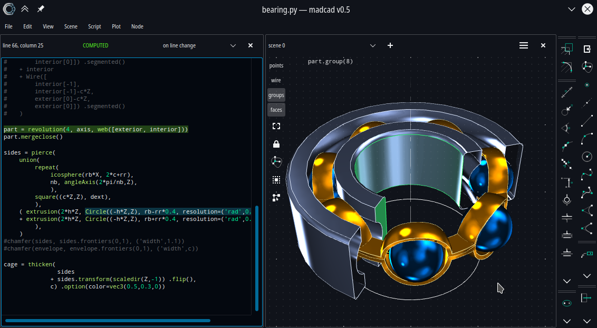

# UI-MADCAD

User-friendly graphical environment for madcad 

- [Official website](https://madcad.netlify.app)
- [Repository](https://github.com/jimy-byerley/pymadcad)
- [Matrix community](https://matrix.to/#/#madcad:matrix.org)

## Features

- 3d geometry interactive edition
- partial execution of code (only the modified code is re-executed)
- quick tools to easily generate 3d primitive objects
- multi-view 3d scene
- multi-view script editor
- fast scene composition for each view
- themable GUI

## About

While **pymadcad** is a powerful and intuitive python module, any  code generating a 3d model still is a script full of coordinates and  computational instructions, that one needs to reexecute and wait for its result to show and every time you change a value. **uimadcad** allows you to view every variable, every expression  in your code just by clicking on it, and interact with the display to  edit it.
With **uimadcad**, you still work on the script, but you can combine the best of both world (text & graphic) together to model faster.

This software is a bit like [openscad](https://openscad.org/) but  using python rather than a dedicated language. I discovered openscad after started developing uimadcad.

## License   

Copyright 2019-2023 Yves Dejonghe <jimy.byerley@gmail.com>

This software is distributed under GPL-v3 license. A copy of that license is provided with this software.